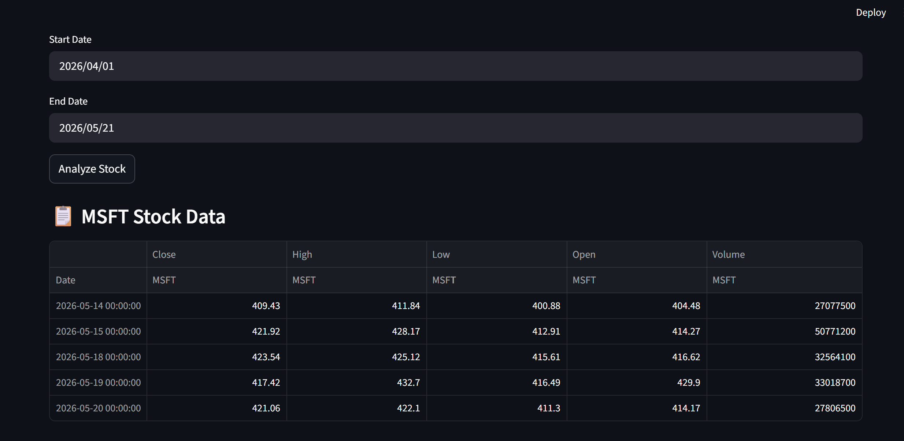
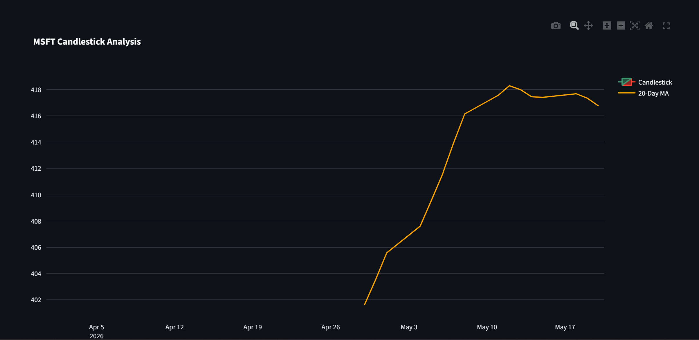

# 🚀 AI Stock Dashboard – Multi-Agent AI Investment Advisor

## 📌 Overview

An AI-powered multi-agent investment advisor built using Python and Streamlit.

The system combines:
- Technical Analysis
- Risk Analysis
- AI-Based Stock Scoring
- News Sentiment Analysis
- Portfolio Recommendations

to generate intelligent stock insights and investment recommendations.

---

# 🧠 Multi-Agent Architecture

The project uses specialized AI agents:

| Agent | Responsibility |
|---|---|
| Technical Analysis Agent | RSI, moving averages, candlestick analysis |
| Risk Analysis Agent | Volatility and risk scoring |
| Scoring Agent | AI stock scoring and recommendation |
| News Sentiment Agent | Market sentiment analysis from news |
| Recommendation Agent | Investment recommendation generation |

---

# 📊 Features

✅ Live Stock Analysis  
✅ Candlestick Charts  
✅ RSI Indicator  
✅ Moving Averages  
✅ AI Recommendation System  
✅ Risk Assessment  
✅ Market Sentiment Analysis  
✅ Multi-Agent Workflow  

---

# 🛠️ Tech Stack

- Python
- Streamlit
- Pandas
- NumPy
- Matplotlib
- Plotly
- yFinance
- Multi-Agent AI Architecture

---

# 📷 Dashboard Preview

(Add screenshots here later)

---

# ⚡ Installation

```bash
git clone https://github.com/Rash1544/ai-stock-dashboard.git

cd ai-stock-dashboard

pip install -r requirements.txt

streamlit run app.py
# 📷 Dashboard Screenshots

## Main Dashboard


## Candlestick Analysis


## AI Recommendation System


## Risk Analysis
